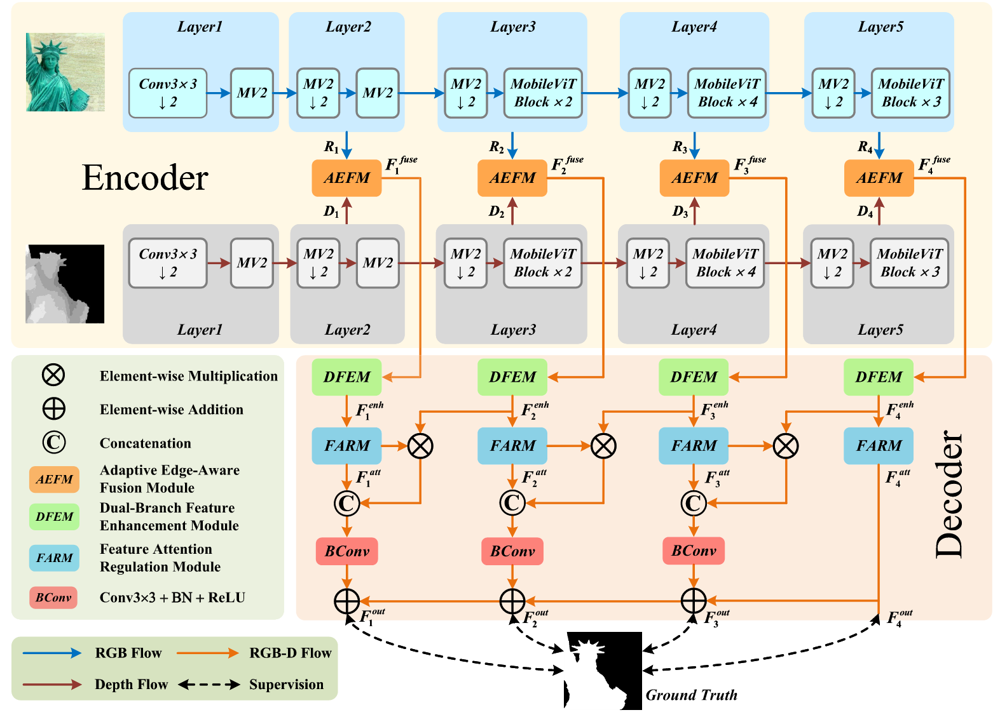
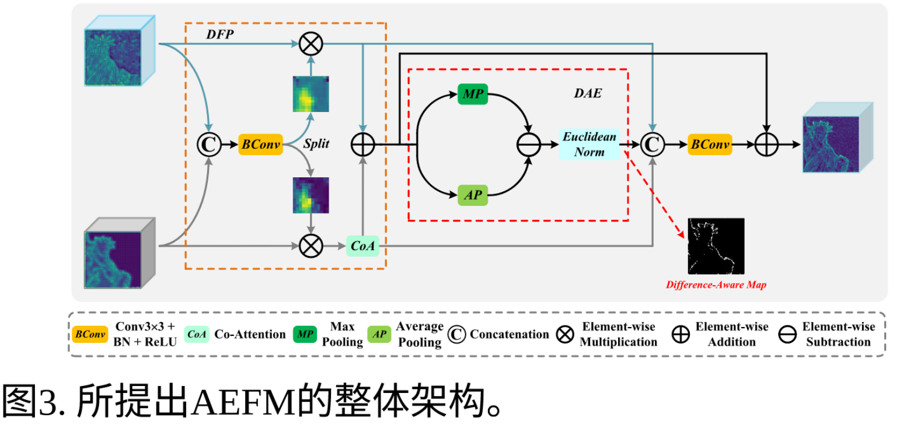
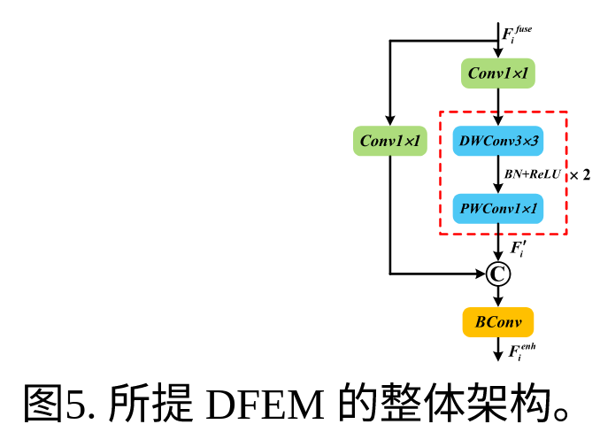
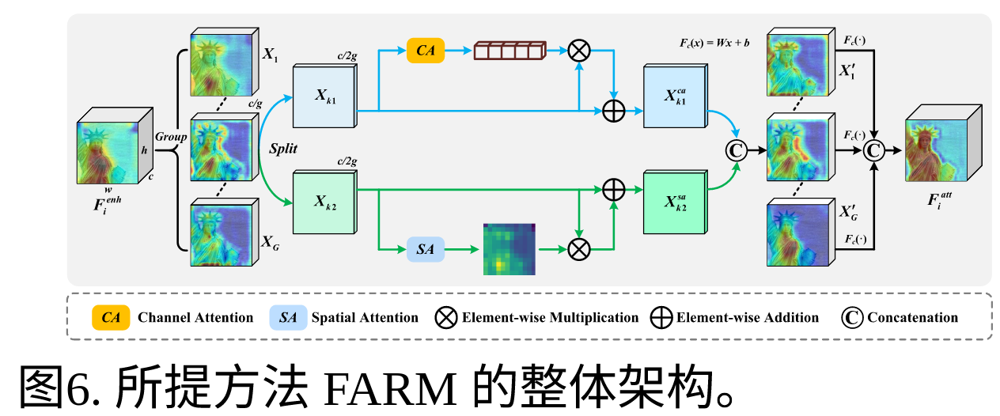
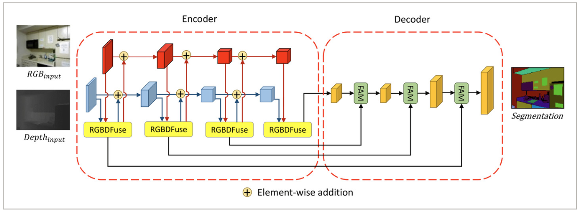
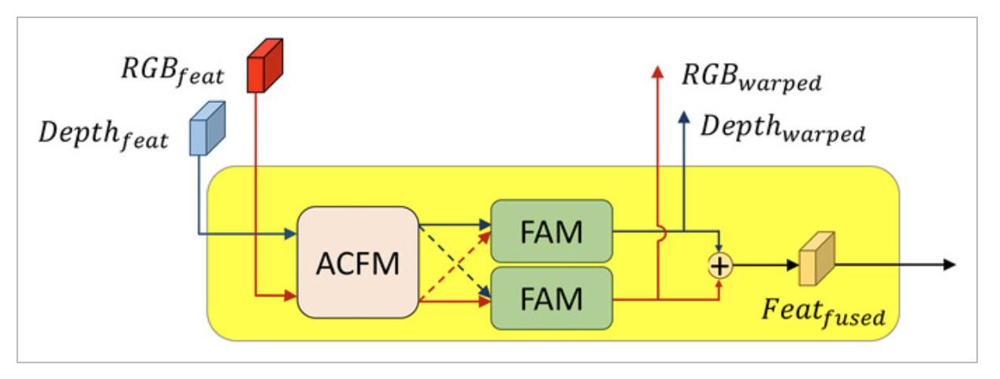
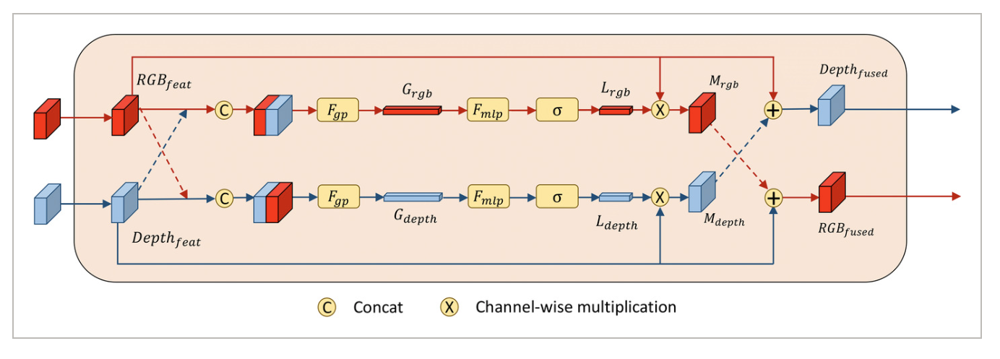
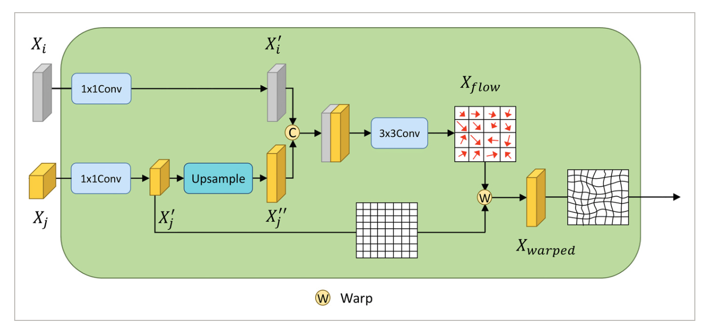

# 1.Henet

Highly Efficient RGB-D Salient Object Detection With Adaptive Fusion and Attention Regulation

https://github.com/BojueGao/HENet





## AEFM模块：

**论文描述**: 自适应边缘感知融合模块。根据特征信息量自适应调整特征在融合过程中的贡献，并在像素级感知融合特征的边缘

对应代码：

```python
class Fusion(nn.Module):
    def __init__(self, channel, h, w):
        super(Fusion, self).__init__()
        self.convTo2 = nn.Conv2d(channel * 2, 2, 3, 1, 1)
        self.sig = nn.Sigmoid()
        self.global_avg_pool = nn.AdaptiveAvgPool2d(1)
        self.global_max_pool = nn.AdaptiveMaxPool2d(1)
        self.h = h
        self.w = w
        self.coordAttention = CoordAtt(channel, channel, self.h, self.w)
        self.channel = channel

        self.glbamp = AP_MP()
        self.conv_cat = nn.Sequential(
            nn.Conv2d(channel * 2 + 1, channel, 1),
            nn.BatchNorm2d(channel, eps=1e-05, momentum=0.1, affine=True, track_running_stats=True),
            nn.ReLU(True),
        )

        self.upsample2 = nn.Upsample(scale_factor=2, mode='bilinear', align_corners=True)

    def forward(self, r, d):
        H = torch.cat((r, d), dim=1)
        H_conv = self.sig(self.convTo2(H))
        g = self.global_avg_pool(H_conv)

        ga = g[:, 0:1, :, :]
        gm = g[:, 1:, :, :]

        Ga = r * ga
        Gm = d * gm

        Gm_out = self.coordAttention(Gm)
        res = Gm_out + Ga

        gamp = self.upsample2(self.glbamp(res))
        gamp = gamp / math.sqrt(self.channel)

        cat = torch.cat((Ga, Gm_out, gamp), dim=1)
        cat = self.conv_cat(cat)
        sal = res + cat

        return sal
```






# 2.FAFNet




RGBDFuse模块：



ACFM模块：



FAM模块：

