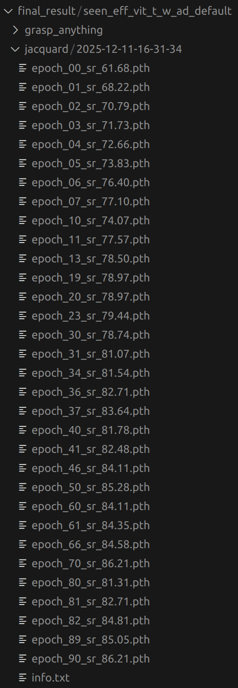
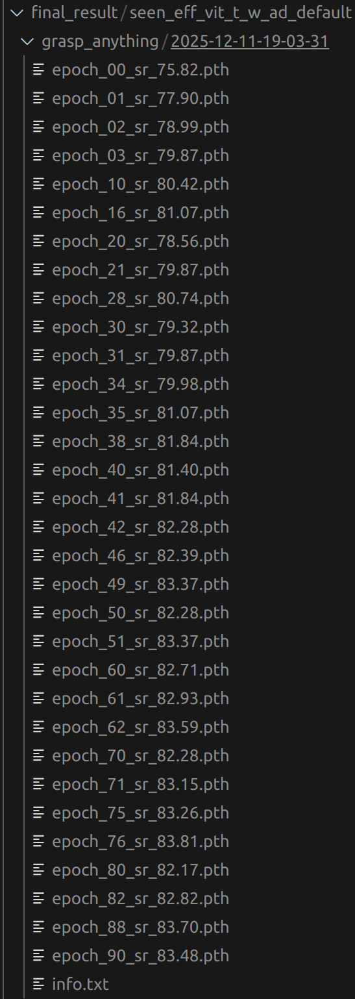
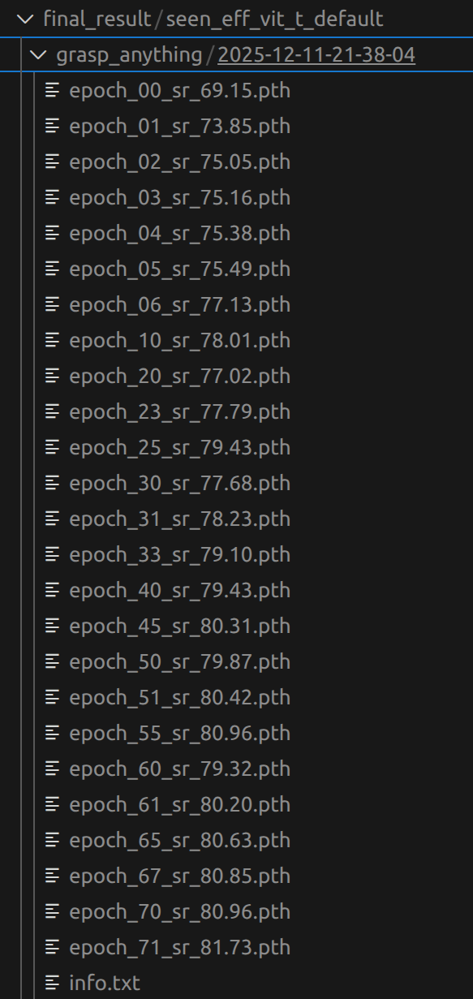

# 视觉-语言抓取网络

# CROG部分（2023）

模型仓库：https://github.com/HilbertXu/CROG

数据集仓库：https://github.com/gtziafas/OCID-VLG

## 1.新建环境:

```
conda create -n CROG python=3.8
```

然后把模型和数据集仓库都克隆

之后进入OCID-VLG目录执行：

```
pip install -r requirements.txt -i https://pypi.tuna.tsinghua.edu.cn/simple
pip install loguru PyYAML wandb lmdb pyarrow -i https://pypi.tuna.tsinghua.edu.cn/simple
```

requirements.txt内容如下(手动修改一下):

```
clip-openai

matplotlib==3.7.1

numpy==1.24.3

opencv_python==4.7.0.72

Pillow==9.5.0

segment_anything==1.0

Shapely==2.0.1

scikit-image

#torch==1.7.1
torch==1.10.1 

#torchvision==0.8.2
torchvision==0.11.2

tqdm==4.65.0
```

## 2.下载CLIP的预训练权重：

（需要在exp/下新建一个pretrain_clip文件夹）

```
wget https://openaipublic.azureedge.net/clip/models/afeb0e10f9e5a86da6080e35cf09123aca3b358a0c3e3b6c78a7b63bc04b6762/RN50.pt -O exp/pretrain_clip/RN50.pt
```

CROG下新建datasets文件夹，放入数据集文件夹OCID-VLG（不是仓库克隆下来的那个文件夹，而是谷歌云盘下载好的数据集并重命名为OCID-VLG）

修改crog_multiple_r50.yaml文件（防止第一次训练缺少权重文件报错）：


## 3.训练模型：

论文作者说两张4090大约需要跑3.5h（说的是35个epoch的情况下），实测3张2080ti训练1个epoch需要32min

```
python -u train_crog.py --config config/OCID-VLG/crog_multiple_r50.yaml
```


## 4.测试模型并可视化

有三个pth，随便选一个就可以

```
python -u test_crog.py --config config/OCID-VLG/crog_multiple_r50.yaml --opts resume exp/OCID-VLG_multiple/CROG_multiple_R50/best_iou_model.pth visualize True
```

生成的图像会被保存在results文件夹下


# ETRG部分（2025）

仓库地址https://github.com/hjy-u/ETRG-RGS

论文作者说代码改编自CROG和ETIRS，训练出来的模型ETRG（900M左右）比CROG（1.6G左右）小了整整一倍，此外**融入了深度图**，解决了CROG未使用深度图的问题

## 1.环境配置

直接用CROG创建的虚拟环境

```
git clone https://github.com/hjy-u/ETRG-RGS.git
```

## 2.下载CLIP的预训练权重：

（新建一个pretrain文件夹，这里和CROG不一样）

```
wget https://openaipublic.azureedge.net/clip/models/afeb0e10f9e5a86da6080e35cf09123aca3b358a0c3e3b6c78a7b63bc04b6762/RN50.pt -O pretrain/RN50.pt
```

## 3.训练模型：

```
python -u train.py --config config/OCID-VLG/etrg_r50.yaml
```

看这训练速度是比CROG还要慢，46.6min一个epoch！！！


# OCID-VLG数据集构成

## 1.ARID10/ARID20


| **文件名** | **内容描述**                | **格式与大小**                                               |
| ---------- | --------------------------- | ------------------------------------------------------------ |
| **rgb**    | **彩色图像**（RGB image）。 | 640×480 PNG 图像。                                           |
| **depth**  | **深度图像**（Depth Map）。 | 640×480 16-bit PNG 图像，深度值以毫米为单位。                |
| **pcd**    | **点云数据**。              | 640×480 组织化的 XYZRGBL 点云文件，包含地面真值 (ground truth)。 |

| **文件名**                   | **内容描述**                         | **格式与作用**                                               |
| ---------------------------- | ------------------------------------ | ------------------------------------------------------------ |
| **label**                    | **像素级物体唯一整数标签**。         | 640×480 16-bit PNG 图像，每个像素带有唯一的整数标签，用于识别每个单独的物体。 |
| **seg_mask_instances_combi** | **实例分割掩码**（Instance Masks）。 | 640×480 8-bit PNG 图像，包含组合后的、**类别无关**的实例掩码。 |
| **seg_mask_labeled_combi**   | **语义分割掩码**（Semantic Masks）。 | 640×480 8-bit PNG 图像，包含组合后的、使用**类别标签**的语义掩码。 |
| **labels.txt**               | 场景中物体**类别标签的序列**。       | 序列顺序定义了物体被添加到场景中的先后顺序。                 |

| **文件名**                | **内容描述**                     | **格式与作用**                                               |
| ------------------------- | -------------------------------- | ------------------------------------------------------------ |
| **Annotations**           | **手动标注的抓取候选**。         | .txt 文件，抓取候选以四个边界框角点坐标表示。                |
| **Annotations_per_class** | **分配给各物体类别的抓取候选**。 | 文件夹结构，每个文件夹包含分配给该物体类别的抓取候选列表（.txt 文件）。 |

### ARID20 结构（基于杂乱程度）

| **分类**   | **级别/字段**             | **含义**                                                     |
| ---------- | ------------------------- | ------------------------------------------------------------ |
| **位置**   | `location: floor, table`  | 场景位于**地面**还是**桌子**上。                             |
| **视角**   | `view: bottom, top`       | 摄像机安装在**下方**还是**上方**。                           |
| **杂乱度** | `free, touching, stacked` | 描述物体间的物理关系：**分离** (1-9 号物体)、**接触** (10-16 号物体)、**堆叠** (17-20 号物体)。 |

### ARID10 结构（基于物体类型）

| **分类**        | **级别/字段**                     | **含义**                                                     |
| --------------- | --------------------------------- | ------------------------------------------------------------ |
| **位置 & 视角** | `location, view`                  | 同 ARID20。                                                  |
| **物体类型**    | `box, curved, fruits, non-fruits` | **盒子**（尖锐边缘）、**曲线**（平滑表面）、**水果**、**非水果**。 |
| **混合**        | `mixed`                           | **盒子**和**曲线**物体的混合场景。                           |

**1.rgb：**存放不同时刻彩图（png格式）


**2.depth：**深度图（png格式），用于抓取预测，提供物体的几何信息。

**3.label：**像素级类别标签（png格式），记录每个像素属于哪个物体类别（如“杯子”、“盒子”）。

**4.labels.txt：**

格式形如：

```
7,17,17,7,7,17,11,27,27,7
```

**5.seg_mask_instances_combi：**实例分割掩码，区分场景中**每个单独的物体**

**6.seg_mask_labeled_combi：**语义分割掩码，区分物体**类别**

**7.Grasps_per_instance：**抓取位姿标注，存储场景中每个物体实例的**4-DoF 抓取矩形**标注信息 

**8.Boxes_per_instance：**实例边界框，存储场景中每个物体实例的 2D 边界框坐标

格式形如：

```
1;11;182 38 451 192
3;34;183 164 378 308
2;35;397 127 529 268
```

**9.Annotations / Annotations_per_class：**暂时没看懂是干嘛的

## 2.refer

存放四种类型的json文件


| **字段名称**                | **存储内容**                        | **含义与关联任务**                                           |
| --------------------------- | ----------------------------------- | ------------------------------------------------------------ |
| **"split"**                 | `"val"`                             | 该样本用于**验证集**（Validation Set）。                     |
| **"image_filename"**        | `"ARID10/.../seq22,..."`            | 场景图片的**存储路径和名称**。模型需要加载该图片进行处理。   |
| **"question"**              | `"Pick the red and white food bag"` | **自然语言指令**。这是模型需要理解的输入，用于定位和抓取物体（RGS 任务）。 |
| **"program"**               | `[...]`                             | **符号化程序**（Symbolic Program）。                         |
| **"answer"**                | `4`                                 | 程序的最终输出。通常是目标物体在场景图或物体列表中的**索引 ID**。 |
| **"target"**                | `"food\_bag\_3"`                    | 目标物体的**实例 ID**。用于在数据集中查找对应的分割掩码（Mask）或详细标注。 |
| **"template"**              | `"Pick the <C> <M> <Y>"`            | 用于生成该自然语言指令的**模板**结构。                       |
| **"concept_map"**           | `{...}`                             | **概念映射**。将模板中的符号（如 `<C>`）映射到具体的属性词（如 "red and white"）。 |
| **"box"**                   | `[381, 121, 113, 77]`               | **目标物体的 2D 边界框**（Bounding Box）。                   |
| **"grasps"**                | `[...]`                             | **抓取位姿标注列表**（Grasp Pose Annotations）。             |
| **"question_family_index"** | `0`                                 | 指令所属的**指令家族** ID。                                  |
| **"question_index"**        | `0`                                 | 指令在该家族中的**索引**。                                   |
| **"template_filename"**     | `"attribute.json"`                  | 指令模板文件来源，表明该指令是基于**属性**（如颜色）来指称物体的。 |

## 3.catalog.csv

存放ID	class	label	color	material	special

格式形如：

```
ID	class	label	color	material	special
1	apple	apple_1	red	organic	
2	apple	apple_2	green	organic	
3	ball	ball_1	blue	plastic	
4	ball	ball_2	yellow	plastic	rugby ball
5	ball	ball_3	red and white	plastic	polka ball,ball with spots,ball with dots
6	banana	banana_1	yellow	organic	
7	bell_pepper	bell_pepper_1	red	organic	
8	binder	binder_1	green	plastic	
```

## 4.OCID_sub_class_dict.py

这段 Python 代码是 **OCID-VLG 数据集**（或其衍生数据集）的**配置和映射文件**。它的主要作用是建立物体类别、具体实例、颜色和实验测试集之间的对应关系，是进行语义分割、实例分割和泛化能力测试的基础


# LGD（CVPR 2024）

## 1.配置环境

和GraspSAM共用一个环境

安装CLIP

```
pip install regex ftfy tqdm -i https://pypi.tuna.tsinghua.edu.cn/simple
pip install git+https://github.com/openai/CLIP.git
```

降numpy版本

```
pip install numpy==1.23.5 -i https://pypi.tuna.tsinghua.edu.cn/simple
```


```
pip install transformers==4.8.1 ruamel.yaml==0.17.32 -i https://pypi.tuna.tsinghua.edu.cn/simple
```


## 2.训练模型

部位级：

```
CUDA_VISIBLE_DEVICES=1 python train_network.py --dataset grasp-anywhere --dataset-path /home/wjj2080/Datasets/Grasp-Anything --add-file-path /home/wjj2080/Datasets/Grasp-Anything/Grasp-Anything++ --description training_grasp_anything++_lggcnn --use-depth 0 --seen 1 --network lggcnn
```

整体级：

```
CUDA_VISIBLE_DEVICES=1 python train_network.py --dataset grasp-anywhere-all --dataset-path /home/wjj2080/Datasets/Grasp-Anything --add-file-path /home/wjj2080/Datasets/Grasp-Anything/Grasp-Anything++ --description training_grasp_anything++_lggcnn --use-depth 0 --seen 1 --network lggcnn
```


# GraspSAM（ICRA 2025）

## 1.新建环境:

```bash
git clone https://github.com/gist-ailab/GraspSAM.git
cd GraspSAM

conda create -n GraspSAM python=3.8
conda activate GraspSAM

# pip install -r requirements.txt
pip install torch==2.0.1 torchvision==0.15.2 opencv-python==4.9.0.80 matplotlib scikit-image timm==0.9.10 tensorboardX torchsummary -i https://pypi.tuna.tsinghua.edu.cn/simple
```

## 2.训练模型

准备好权重和数据集

sam解码器可选参数："vit_b", "vit_l", "vit_h", "vit_t", "vit_t_w_ad",  "eff_vit_t", "eff_vit_s", "eff_vit_t_w_ad", "eff_vit_s_w_ad"，其中w_ad代表有adapter

### jacquard数据集：

```
python train.py --gpu-num 2 --save-start-epoch 30 --root /home/wjj2080/Datasets/Jacquard_Dataset --sam-encoder-type vit_t_w_ad --seen --validate --save
```

初步估算，使用2080ti跑jacquard的3844张训练集，15分钟1个epoch，跑50epoch需要12.5h，还可以接受

ai写的多卡训练：

```
torchrun --nproc_per_node=3 train_ddp.py --root /home/wjj2080/GraspSAM/datasets/Jacquard_Dataset --sam-encoder-type vit_t_w_ad --seen --validate --save
```

### GraspAnything数据集：

训练前要把data/base_grasp_data.py里的ocid = True改成False

```
python train.py --gpu-num 2 --dataset-name grasp_anything --root /home/wjj2080/Datasets/Grasp-Anything --sam-encoder-type vit_t --seen --validate --save
```


去掉--seen是train_dataset size : 4198

多卡训练：

```
torchrun --nproc_per_node=3 train_ddp.py --dataset-name grasp_anything --root /home/wjj2080/Datasets/Grasp-Anything --sam-encoder-type vit_t --seen --save --validate
```


## 3.验证模型

验证前确保eval.py里的编码器和训练使用的编码器一致

### jacquard数据集：

```
python eval.py --gpu-num 1 --dataset_name jacquard --root /home/wjj2080/Datasets/Jacquard_Dataset --ckp_path /home/wjj2080/GraspSAM/final_result/total_vit_t_default/jacquard/2025-12-11-10-49-01/epoch_00_sr_0.00.pth
```


### GraspAnything数据集：

```
python eval.py --gpu-num 0 --dataset_name grasp_anything --root /home/wjj2080/Datasets/Grasp-Anything --ckp_path /home/wjj2080/GraspSAM/final_result/seen_vit_t_default/grasp_anything/2025-12-07-14-13-36/epoch_00_sr_0.00.pth 
```

# GraspAnything数据集构成

## 1.image

包含994860张图片,416*416的jpeg图片

这是其中第一张图片，名为000018668931a8fb14891fa2b4c0aaa4b50334d17c20d7d2f6306cc47b2f9830.jpg


其中苹果是0，鸭子是1

## 2.mask

包含1872664个物体掩码图片，.npy格式

比如，鸭子的掩码文件名称：

000018668931a8fb14891fa2b4c0aaa4b50334d17c20d7d2f6306cc47b2f9830_1.npy

可视化后如图所示：


## 3.scene_description

包含994860个场景描述， .pkl格式

通过脚本读取内容如下：

(   'A small green apple and a yellow rubber duck sitting on a wooden table',
    ['apple', 'duck'])

## 4.grasp_label_positive

包含1385213个正面抓取标签

以下是**苹果**的抓取标签文件000018668931a8fb14891fa2b4c0aaa4b50334d17c20d7d2f6306cc47b2f9830_0.pt

可视化结果如下：

数据形状: torch.Size([7, 6])

第 1 个抓取: ['0.13', '380.08', '202.91', '106.01', '20.53', '30.80']
第 2 个抓取: ['0.10', '379.59', '200.64', '102.59', '26.60', '173.18']
第 3 个抓取: ['0.08', '385.75', '195.19', '122.18', '27.11', '27.63']
第 4 个抓取: ['0.07', '378.81', '187.35', '88.25', '20.12', '31.98']
第 5 个抓取: ['0.06', '378.74', '186.81', '90.93', '24.45', '169.46']
第 6 个抓取: ['0.05', '385.85', '173.86', '108.71', '26.19', '36.80']

第一个数值没啥用，应该是置信度 score，后面5个数值是

**`x`**: 抓取中心横坐标

**`y`**: 抓取中心纵坐标

**`w`**: 抓取宽度 (Width)

**`h`**: 抓取高度/长度 (Height/Length)

**`theta`**: 抓取角度 (角度制，Degree)

# GraspAnything++数据集构成

## 1.image

继承graspanything的图片

## 2.grasp_instructions

4412383个抓取描述

苹果有四个部位的抓取描述，第一个0代表苹果，后面的0、1、2、3代表4种抓取方式

000018668931a8fb14891fa2b4c0aaa4b50334d17c20d7d2f6306cc47b2f9830_0_0.pkl：

'Pick up apple by its skin.'

000018668931a8fb14891fa2b4c0aaa4b50334d17c20d7d2f6306cc47b2f9830_0_1.pkl：

'Take apple by its flesh.'

000018668931a8fb14891fa2b4c0aaa4b50334d17c20d7d2f6306cc47b2f9830_0_2.pkl：

'Pick up apple by its seeds.'

000018668931a8fb14891fa2b4c0aaa4b50334d17c20d7d2f6306cc47b2f9830_0_3.pkl：

'Take hold of apple on its stem.'

## 3.part_mask

4412383个部位级掩码


## 4.grasp_label_positive

4412383个正面抓取标签


# 数据集划分规则

​	在LGD论文原文中，并没有使用完整的jacquard和graspanything、graspanything++数据集，而是取了LVIS数据集中的300个类别，做一下标签的对齐工作，对不齐的类别直接就舍去，将对齐后的数据集，取出现频率前70%的物体做Base（Seen），后30%做New（Unseen）

​	对齐后的数据集样本量大大减小，通过脚本查看LGD的split中的obj文件可以看到：

**jacquard/seen.obj:**

列表总长度 (包含的物体ID数量): 4272
推算: 如果按 0.9 划分训练集，数量应为: 3844

**jacquard/unseen.obj:**

列表总长度 (包含的物体ID数量): 374

推算: 如果按 0.9 划分训练集，数量应为: 336

【前 20 个物体 ID】:
  1. 3_2b253a37d3421530e3f7a74e12a274ef
  2. 4_2af59465484a93c4b6c3a1b8389374f
  3. 3_1fb5f662caaaefc12a46d433750272a2
  4. 3_2c118800181f296a855931d119219022

**grasp-anything/seen.obj:**

列表总长度 (包含的物体ID数量): 15089

推算: 如果按 0.9 划分训练集，数量应为: 13580

【前 20 个物体 ID】:
    1. 3f731b45f25001fecd4ec58cbb1178f5c274b69c62d4f4df2ebed0bb996a570f_0
        2. 3f731b45f25001fecd4ec58cbb1178f5c274b69c62d4f4df2ebed0bb996a570f_1
        3. 83c43efd13b7d0c6c08647445861244f462effcfabc4df8f5fbe2224e01c9c85_0
        4. 83c43efd13b7d0c6c08647445861244f462effcfabc4df8f5fbe2224e01c9c85_1

实际排除缺失标签，只有**8223+914**的数量

**grasp-anything/unseen.obj:**

列表总长度 (包含的物体ID数量): 8009
推算: 如果按 0.9 划分训练集，数量应为: 7208

实际排除缺失标签，只有**4198**的数量

**grasp-anything++/train/seen.obj:**

从grasp-anything/seen.obj中取的子集（15089=14516+573）

列表总长度 (包含的物体ID数量): 14516

所以训练graspanything++时train里的seen.obj不需要再划分

**grasp-anything++/test/seen.obj:**

从grasp-anything/seen.obj中取的子集

列表总长度 (包含的物体ID数量): 573

**grasp-anything++/test/unseen.obj:**

列表总长度 (包含的物体ID数量): 230

# 数据集提取

**注：grasp-anything++的seen和unseen都是从grasp-anything中取出来的**

论文中都是用seen和unseen做划分的，所以可以把这两部分提取出来，放到服务器上跑，节省硬盘空间，以及加快数据预处理速度

obj编号规则是图片编号+物体索引，对应到每一个物体，seen和unseen合并后一共17783张图片，23098个物体

**graspanything提取：**

seen+unseen总共23098个物体

提取image：任务完成 [image]: 成功 17783, 缺失 0

提取mask：任务完成 [mask]: 成功 19166, 缺失 3932

（说明有3932个物体缺失掩码）

提取scene_sescription:总计(23098)，任务完成 [scene_description]: 成功 17783, 缺失 0

提取grasp_label_positive：总计(23098)，任务完成 [grasp_label_positive]: 成功 13335, 缺失 9763

（说明有9763个物体缺失抓取标签）

提取grasp_label_negative：任务完成 [grasp_label_negative]: 成功 13335, 缺失 9763

综上所述，有部分物体缺失掩码标签，有些物体缺失抓取标签

**graspanything++提取：**


  - **seen Train (前90%)**

  - 总样本数 (Samples/Instructions): 26997
  - 唯一图片数 (Unique Images):      7913

  - **seen  Test**

  - 总样本数 (Samples/Instructions): 540
  - 唯一图片数 (Unique Images):      173

  - **unseen  Test/Val (后10%)**

  - 总样本数 (Samples/Instructions): 61
  - 唯一图片数 (Unique Images):      21


**29997+540+61=30598正好是提取出来的总数**


**jacquard提取：**

jacquard数据集结构为多个形如1a1ec1cfe633adcdebbf11b1629fc16a的文件夹组成，里面放置了若干文件：

0_1a1ec1cfe633adcdebbf11b1629fc16a_grasps.txt

0_1a1ec1cfe633adcdebbf11b1629fc16a_mask.png

0_1a1ec1cfe633adcdebbf11b1629fc16a_perfect_depth.tiff

0_1a1ec1cfe633adcdebbf11b1629fc16a_RGB.png

0_1a1ec1cfe633adcdebbf11b1629fc16a_stereo_depth.tiff

其中最开始的数字代表不同视角，后面还有形如1_1a1ec1cfe633adcdebbf11b1629fc16a_grasps.txt等文件，以此类推，现在我希望合并/home/wjj/code/split/jacquard/seen.obj和/home/wjj/code/split/jacquard/unseen.obj这两个文件，然后根据这两个文件包含的内容（如 0_1ea53d7144e90f8d3d57bacf9d130342等）去/home/wjj/Documents/数据集/Jacquard中，把所有符合条件的文件都提取出来，而且还要保持数据集结构不变


# GraspSAM改进思路

1.像maplegrasp一样，先预测出物体掩码，然后利用掩码排除背景，只预测掩码部分的抓取

将graspsam的并行预测掩码和抓取改成串行

2.加入CLIP/BERT，实现语言驱动的抓取：

要么单独写一个带文本版的，要么合起来写（既可以点提示、也可以文本提示），先考虑前者，再考虑后者，后者的话属于一种创新

3.调整adapter

4.特征融合

5.提出一个自己的数据集，然后在上面做实验

# 复现实验记录


这张倒数第二行是mobilesam+rein跑出来的结果

最后一行是efficientsam+rein跑出来的结果


这张表记录的是使用efficientsam情况下是否使用Rein adapter的对比结果


这张是使用efficientsam+grounding dino在graspanything++上跑出来的结果


seen=true train=true取seen前0.9,总数3844

seen=true train=false = 取seen后0.1，总数428

seen=false 取unseen全部，总数374


## 1.train.py jacquard 4090 eff_vit_t_w_ad 3844训练 428验证 374unseen

```
python train.py --dataset-name jacquard --gpu-num 1 --save-start-epoch 0 --root /home/wjj4090/Datasets/Jacquard --sam-encoder-type eff_vit_t_w_ad --batch-size 4 --seen --validate --save
```



最高准确率文件名：epoch_46_sr_**84.11**.pth、epoch_70_sr_86.21.pth

论文中是**0.87**

```
python eval.py --gpu-num 0 --dataset_name jacquard --root /home/wjj4090/Datasets/Jacquard --ckp_path /home/wjj4090/GraspSAM/final_result/seen_eff_vit_t_w_ad_default/jacquard/2025-12-11-16-31-34/epoch_46_sr_84.11.pth
```

使用最高权重在unseen上测试准确率为：

epoch_46_sr_84.11.pth:success rate : **67.91**% | correct : 254,  failed : 120

epoch_70_sr_86.21.pth:success rate : 67.38% | correct : 252,  failed : 122

论文中是**0.75**

## 2.train.py graspanything 4090 eff_vit_t_w_ad 8823训练 914验证 4198unseen

```
python train.py --dataset-name grasp_anything --gpu-num 0 --save-start-epoch 0 --root /home/wjj4090/Datasets/Grasp-Anything --sam-encoder-type eff_vit_t_w_ad --batch-size 4 --seen --validate --save
```



最高准确率文件名：epoch_49_sr_**83.37**.pth、epoch_76_sr_83.81.pth

论文中是**0.83**

```
python eval.py --gpu-num 0 --dataset_name grasp_anything --root /home/wjj4090/Datasets/Grasp-Anything --ckp_path /home/wjj4090/GraspSAM/final_result/seen_eff_vit_t_w_ad_default/grasp_anything/2025-12-11-19-03-31/epoch_49_sr_83.37.pth
```

使用最高权重在unseen上测试准确率为：

epoch_49_sr_83.37.pth：success rate : **74.39**% | correct : 3123,  failed : 1075

epoch_76_sr_83.81.pth：success rate : 74.87% | correct : 3143,  failed : 1055

论文中是**0.81**

## 3.train.py jacquard eff_vit_t 2080 3844训练 428验证 374unseen

```
python train.py --dataset-name jacquard --gpu-num 1 --save-start-epoch 0 --root /home/wjj2080/Datasets/Jacquard --sam-encoder-type eff_vit_t --batch-size 8 --seen --validate --save
```



最高准确率文件名：epoch_45_sr_**79.44**.pth、epoch_86_sr_82.01.pth

论文中是**0.86**

```
python eval.py --gpu-num 1 --dataset_name jacquard --root /home/wjj2080/Datasets/Jacquard --ckp_path /home/wjj2080/GraspSAM/final_result/seen_eff_vit_t_default/jacquard/2025-12-11-21-34-40/epoch_45_sr_79.44.pth
```

使用最高权重在unseen上测试准确率为：

epoch_45_sr_79.44.pth：success rate : **58.29**% | correct : 218,  failed : 156

epoch_86_sr_82.01.pth：success rate : 60.96% | correct : 228,  failed : 146

论文中是**0.66**

## 4.train.py grasp_anything eff_vit_t 2080 8823训练 914验证 4198unseen

```
python train.py --dataset-name grasp_anything --gpu-num 0 --save-start-epoch 0 --root /home/wjj2080/Datasets/Grasp-Anything --sam-encoder-type eff_vit_t --batch-size 8 --seen --validate --save
```

最高准确率文件名：epoch_45_sr_**80.31**.pth、epoch_71_sr_81.73.pth

论文中是**0.80**

```
python eval.py --gpu-num 0 --dataset_name grasp_anything --root /home/wjj2080/Datasets/Grasp-Anything --ckp_path /home/wjj2080/GraspSAM/final_result/seen_eff_vit_t_default/grasp_anything/2025-12-11-21-38-04/epoch_45_sr_80.31.pth
```

使用最高权重在unseen上测试准确率为：

epoch_45_sr_80.31.pth：success rate : **71.96**% | correct : 3021,  failed : 1177

epoch_71_sr_81.73.pth：success rate : 72.06% | correct : 3025,  failed : 1173

论文中是**0.75**


# 后期改进需要做的实验：

1.利用物品名称描述（“apple”）进行抓取预测

对比实验：包括和graspsam+clip以及经典网络+clip的效果对比

消融实验：单一文本提示、单一点提示、点和文本双重提示


2.细粒度的文本驱动抓取实验，利用细粒度文本描述（'Pick up apple by its skin.'）进行抓取预测

对比实验：包括和graspsam+clip以及经典网络+clip的效果对比

消融实验：有无adapter，然后别的策略等等


3.单一点框情况下无文本描述与其他基线模型的对比


两阶段训练，一阶段利用真实掩码
